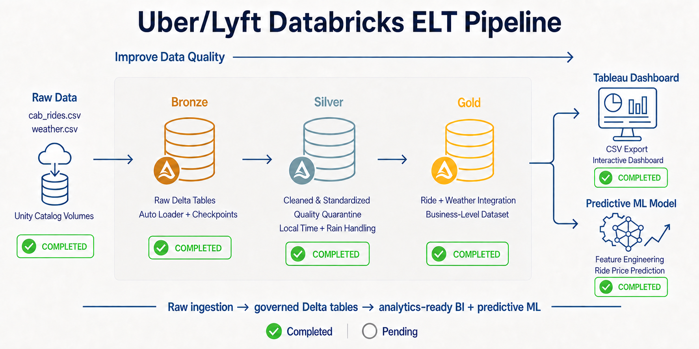
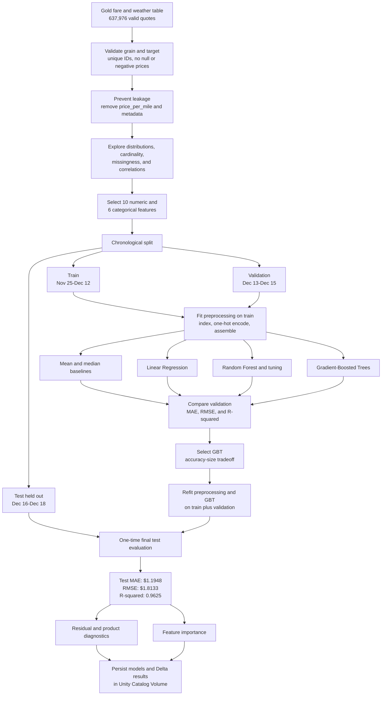

# Uber vs Lyft Fare Analytics

An end-to-end data engineering, business intelligence, and machine-learning
project that transforms public Uber and Lyft fare estimates and Boston weather
observations into governed Delta tables, a Tableau-ready dataset, an
interactive pricing dashboard, and a tested ride-fare prediction model.

The source records are **fare quotes**, not completed rides, bookings, revenue, or rider demand.

## Project Highlights

- Processed 693,071 source fare records through a Bronze, Silver, and Gold medallion architecture.
- Retained 637,976 valid fare quotes and quarantined 55,095 records with missing prices.
- Matched every valid quote to source and destination weather observations within the configured tolerance.
- Produced a validated 35-column Tableau dataset.
- Built an interactive dashboard for provider, service-tier, route, distance, time, and recorded-surge analysis.
- Packaged the dashboard with its extract so it can be opened without a separate data connection.
- Trained and compared baseline, linear, Random Forest, and Gradient-Boosted
  Trees regression models using leakage-safe chronological splits.
- Selected a Gradient-Boosted Trees model that achieved a **$1.19 test MAE**
  and **0.9625 test R²** on the untouched final time period.

## Architecture



```text
Kaggle source files
    |
    v
Unity Catalog Volumes
    |
    v
Databricks ELT Pipeline
    |-- Bronze: raw Delta tables and ingestion metadata
    |-- Silver: cleaning, validation, enrichment, and quarantine
    `-- Gold: fare quotes joined with endpoint weather
           |
           |-- Tableau-ready CSV --> Packaged Tableau dashboard
           `-- Curated Gold data --> Tested GBT fare-prediction model
```

The Databricks ELT pipeline, Tableau dashboard, and predictive-modeling stage
are complete. MLflow experiment tracking and production deployment remain
possible future extensions.

## Project Progress

| Stage | Status | Result |
|---|---|---|
| Source data | Completed | Cab-ride and weather files identified and downloaded |
| Unity Catalog | Completed | Governed source, checkpoint, and export storage created |
| Bronze | Completed | Raw CSV data ingested with Auto Loader into Delta tables |
| Silver | Completed | Fare and weather records cleaned, standardized, and validated |
| Gold | Completed | Fare quotes matched to source and destination weather |
| Tableau export | Completed | Validated 35-column analytical dataset created |
| Tableau dashboard | Completed | Interactive dashboard packaged as a `.twbx` workbook |
| Predictive model | Completed | GBT selected and tested on an untouched chronological holdout |
| Model artifacts | Completed | Preprocessing model, GBT model, and evaluation summaries persisted |
| MLflow and deployment | Future extension | Add experiment tracking, registry, monitoring, and serving |

## Tableau Dashboard


The **Uber vs Lyft: Ride Pricing Analytics | Nov-Dec 2018** dashboard includes:

- Fare-quote counts by comparable service tier.
- Route-level median fare and median price-per-mile comparisons.
- Median distance versus pricing analysis across directional routes.
- Daily pricing trends for the selected route and service tier.
- Recorded surge-status comparisons by provider.
- Date-granularity, date-period, route, pricing-metric, and service-tier controls.

### Dashboard Files

- [Download the packaged Tableau workbook](tableau/uber_lyft_fare_comparison.twbx)
- [Read the complete dashboard findings](docs/Tableau_Insights.md)

### Headline Findings

- Lyft had slightly lower median pricing in the Standard and XL tiers.
- Uber had lower median pricing in the Premium Black and Premium Black XL tiers.
- Longer routes generally had higher total fares but lower prices per mile.
- Recorded surge appeared in Lyft quotes, while the source field contained no Uber surge multiplier above `1`.

The recorded-surge result describes only the source data and does not prove that Uber never used dynamic pricing.

## ELT Workflow

| Layer | Main responsibility | Output |
|---|---|---|
| Bronze | Preserve raw values and capture ingestion metadata | Raw fare and weather Delta tables |
| Silver | Clean, standardize, validate, enrich, and quarantine records | Analytics-ready fare and weather tables |
| Gold | Match each valid fare quote to source and destination weather | Tableau and modeling dataset |

[Read the complete Databricks ELT pipeline documentation](docs/Databricks_ELT_Pipeline.md)

### Key Validation Results

| Metric | Result |
|---|---:|
| Source fare records | 693,071 |
| Valid fare quotes | 637,976 |
| Quarantined missing-price records | 55,095 |
| Unique valid fare-quote IDs | 637,976 |
| Source-weather match rate | 100% |
| Destination-weather match rate | 100% |
| Tableau export columns | 35 |

The valid and quarantined fare records reconcile to the complete source population. The Gold table maintains one row per valid fare quote.

## Machine Learning Workflow

The modeling notebook predicts the quoted `price` while excluding
`price_per_mile`, which directly contains the target. Dates are split
chronologically, and preprocessing is fitted without access to the future test
period.



### Modeling Outcome

- GBT was selected over the marginally more accurate 109 MB tuned Random
  Forest because it provided a better accuracy-size tradeoff.
- The final untouched test results were **$1.1948 MAE**, **$1.8133 RMSE**, and
  **0.9625 R²**.
- Ride product, distance, and surge multiplier accounted for approximately
  96% of final model importance.
- Residual analysis found almost no aggregate bias, no negative predictions,
  and a 95th-percentile absolute error of **$3.41**.

- [Read the complete machine-learning analysis](docs/ML_Analysis_Report.md)
- [View the machine-learning notebook](notebooks/05_ML_Price_Prediction.py)
- [Review the Gold dataset data dictionary](docs/Data_Dictionary.md)

## Technology Stack

- Databricks and Apache Spark
- PySpark and Spark SQL
- Delta Lake medallion architecture
- Unity Catalog tables and volumes
- Auto Loader with checkpoints
- Tableau Desktop
- Python, PySpark ML, pandas, Matplotlib, and seaborn

## Data Source

The project uses the public [Uber & Lyft Cab Prices dataset on Kaggle](https://www.kaggle.com/datasets/ravi72munde/uber-lyft-cab-prices), published under the **CC0: Public Domain** license.

- `cab_rides.csv` contains fare estimates, providers, products, locations, distances, prices, and surge multipliers.
- `weather.csv` contains weather observations for the Boston locations represented in the fare data.

Large source and Tableau-export CSV files are excluded from Git. Download the source files from Kaggle and upload them to the corresponding Unity Catalog volumes before running the pipeline.

## Repository Structure

```text
Uber_Lyft_Databricks_ELT_Tableau
|-- notebooks
|   |-- 00_Environment_Validation.py
|   |-- 01_Bronze_Ingestion.py
|   |-- 02_Silver_Transformations.py
|   |-- 03_Gold_Analytics.py
|   |-- 04_Tableau_Export.py
|   `-- 05_ML_Price_Prediction.py
|-- tableau
|   `-- uber_lyft_fare_comparison.twbx
|-- docs
|   |-- Data_Dictionary.md
|   |-- Databricks_ELT_Pipeline.md
|   |-- ML_Analysis_Report.md
|   `-- Tableau_Insights.md
|-- images
|   |-- uber_lyft_databricks_tableau_ml_architecture.png
|   `-- uber_lyft_tableau_dashboard.png
`-- README.md
```

## Run the Project

1. Download `cab_rides.csv` and `weather.csv` from the Kaggle source.
2. Upload the files to the configured Unity Catalog volumes.
3. Run the notebooks in numeric order from `00_Environment_Validation.py`
   through `05_ML_Price_Prediction.py`.
4. Open the packaged Tableau workbook to explore the completed dashboard and
   embedded extract.
5. Review the saved model and evaluation artifacts in the configured Unity
   Catalog volume.

## Possible Next Steps

- Track experiments, parameters, metrics, and artifacts with MLflow.
- Register and version the selected model in Unity Catalog.
- Add batch-scoring or model-serving workflows.
- Monitor prediction error and feature drift as newer quotes become available.
